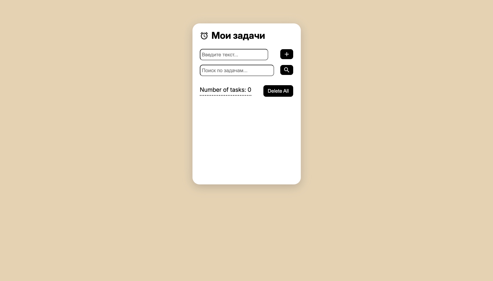

# ToDo List 

Простое и удобное приложение для управления задачами с сохранением на сервере и в `localStorage`, а также с адаптивным дизайном.




## Технологии

- JavaScript (ES6+)
- JSON Server (Mock API)
- localStorage
- CSS3 (Flexbox, адаптив)
- HTML5

## Функционал

- Добавление задач
- Удаление задач (по одной и всех)
- Отметка "выполнено"
- Поиск по названию
- Счётчик активных задач
- Сохранение в `localStorage`
- Загрузка с сервера (JSON Server)
- Адаптивный дизайн

## Как запустить

1. **Клонируй репозиторий:**

```bash
git clone https://github.com/J1NKS12/todo-list-js.git
cd "Todo-list"
```

2. **Установи JSON Server:**

```bash
npm install -g json-server
```

3. **Запусти сервер:**

```bash
json-server --watch json/db.json --port 3000
```

4. **Открой index.html в браузере (через Live Server)**
